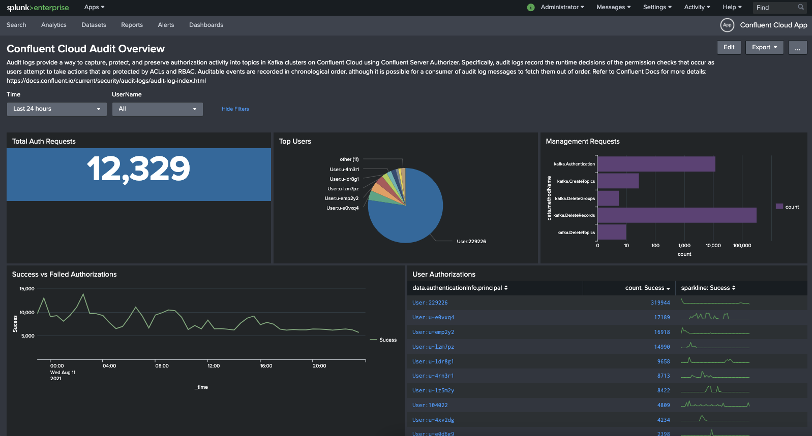
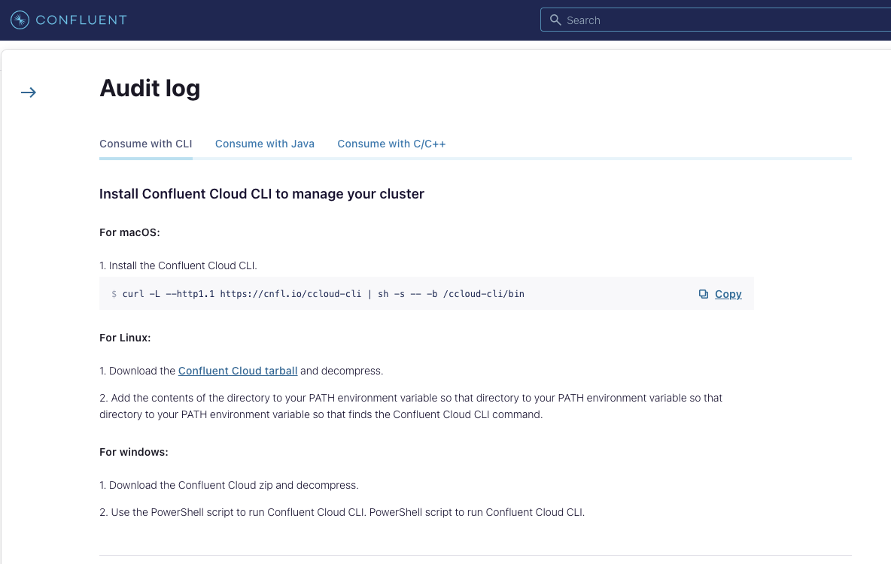

# Confluent Cloud AuditLogs with Splunk Dashboards
Quicky get access to Confluent Cloud with this script. This repo runs a Kafka standalone-connect worker which is needs to be configured to connect to a Confluent Cloud instance. Apart from Kafka Connect (Confluent Platform Binary), this repo will also spin up a Splunk Enterprise instance in Docker.

<p align="center">
   
   &nbsp;
   
</p>

   
#Pre-requisistes
- docker
- Need to edit two files with your details (see below)
```-my-connect-standalone.properties 
-splunksink.properties```

To get started:
```
1. git clone https://github.com/JohnnyMirza/ccloudauditlogs_splunk_standalone.git
2. Option 1: From your Confluent Cloud Console, "CLI and tools -> Kafka Connect" and generate a "my-connect-standalone.properties" file.
   Option 2: There is a sample "my-connect-standalone.properties.sample" in this repo, you can added your API-keys in the relevant section (rename to my-connect-standalone.properties). refer to the below for more details
    -CLOUD_URL: cluster->Settings->Bootstrap server
    -CLOUD_KEY: cluster->API keys
    -CLOUD_SECRET: cluster->API keys
    -SCHEMA_REGISTRY_URL: Environment->Schema Registry->API endpoint
4. Copy the splunksink.properties.sample to splunksink.properties and add change the 'confluent.topic.bootstrap.servers' to your cloud instance. (same as CLOUD_URL above)
5. docker-compose up -d
6. Run standalone connect
    ./confluent/bin/connect-standalone my-connect-standalone.properties splunksink.properties
```


**Access to Splunk Dashboards
to log into splunk go to:
- `http://localhost:8000/en-GB/app/confluent_cloud_app/audit_overview`
- `http://localhost:8000`
(admin/Password1)
